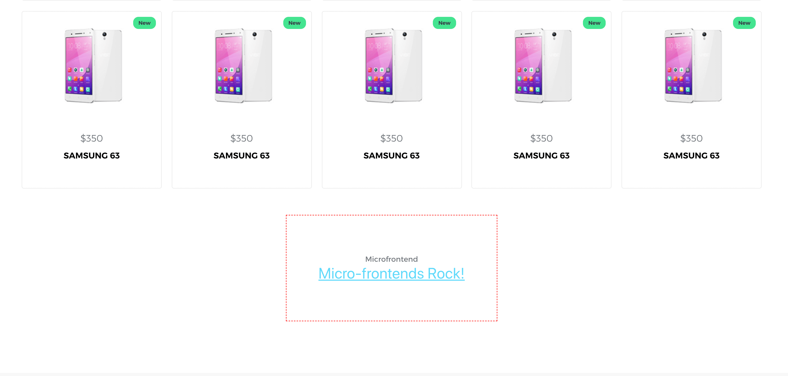

# WAR MACHINE


#### War Machine is a micro-frontend tool that enables you to extend your current theme with other micro apps, creating a true war machine.

---
* [How to develop locally?](#####how-to-use-for-local-development)
---

##### How to use for local development
- clone the project
- in package.json add to dependencies "war-machine-package": "file:putHereRelativePathToTheProject", for example:
```
"war-machine-package": "file:../../war-machine-package"
```
and in the root of your project run the command
```
npm link
```
then you will be able to import the war-machine-package
```
import warMachine from 'war-machine-package'
```

If you do not want to make changes to war machine project and just want to use it:

1. When it is published you can just install it
```
npm install war-machine-package
```
2. Reference project on BitBucket in your package.json
```
"commons-package": "https://MeanUros@bitbucket.org/stacktrail/war-machine-package.git"
```

---

### How to create plugin and load it in your app

Currently this has been tested  with React but technically it can be used with Vue, Angualr or any other SPA framework.

#### How does it work?
It is really simple.  
If you think about it every SPA is bundled with webpack into js modules and css stylesheets, client then just request
those files and executes them, rendering the app in the browser.  
What we did is we requested those files manually, executed them and rendered the app inside of an element on the page.  
Making essentially one SPA consist of many others aka **Microfrontends**. 

#### Creating a plugin

**First, what is a plugin? And why do you call it a plugin?**

In it's essence plugin is a small SPA application. 
It is meant to be used as a part of the bigger app to extend it's functionality.
Like they use plugins in Wordpress, just a lot lot lot looooot better.
You would write a small functionality(eg. blog plugin) and add it to your site programmatically only if you need it. 
Plug and play.  
Hence the term "plugin".

**How to create a plugin app:**

First create a react app.

index.js should look like this:
```
import App from './main';

if (window.location.port === '3000') {
    App('#app')
} else {
    global['pluginName'] = App
}
```
If you are developing locally, you can still use and develop this app separately.  
If it is ran on port 3000(or any port you set) it will render the app normally and if not
it will assign the app to the global object to be executed when we load it in out theme.   

In your main.js
```
export default (element) => {
    render((
            <App/>
        ),
        document.querySelector(element)
    )
}
```
In your main.js you will render your app and attach it to element passed you passed in your index.js


**How to use plugin in your theme:**

In the component you want to render the plugin add section element with class or id of the plugin name. 
On componentDidMount call warMachine with element and url where your app is located.
```
import warMachine from 'war-machine-package'


class Index extends React.Component {
  componentDidMount () {
    this.loadPlugin()
  }

  loadPlugin () {
    const opts = {
      el: '#first-plugin',
      baseUrl: 'http://localhost:3000/static'
    }

    warMachine(opts)
  }
  
  ...
  
    render () {
      return (
        <Layout>
          ...
          <section id='first-plugin'></section>
        </Layout>
      )
    }
```

This will call our plugin app and load it in the section element.


Woala Plugin system in SPAs!!!  
**Fuck Wordpress**